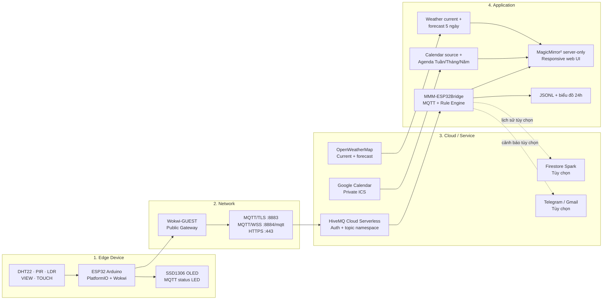
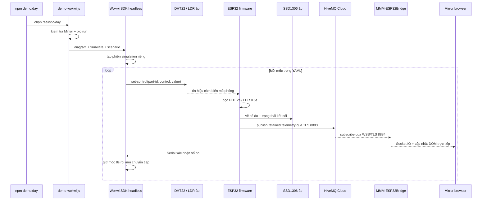

# Gương thông minh hiển thị thông tin — mô phỏng IoT hoàn chỉnh

Project mô phỏng đầy đủ **Edge → Network → Cloud/Service → Application** mà không
dùng phần cứng thật. ESP32 và toàn bộ cảm biến/chấp hành chạy trong Wokwi; dữ liệu
được gửi qua HiveMQ Cloud bằng MQTT/TLS rồi hiển thị real-time trên MagicMirror²
server-only tại `http://localhost:8080`.

Toàn bộ project chạy trong **một workspace VS Code**, dùng các gói miễn phí và
không cần Wokwi Private Gateway, broker công cộng ẩn danh, PubNub, Google
Assistant hay Home Assistant.

## Bắt đầu nhanh

Sau khi đã tạo `.env` và điền các biến bắt buộc:

```powershell
# Terminal 1 — cài dependency và chạy giao diện
Set-Location mirror
npm install
npm run config:check
npm run server

# Terminal 2 — demo cảm biến Wokwi end-to-end trong khoảng 2 phút
Set-Location mirror
npm run demo:day
```

Mở `http://localhost:8080` trước khi chạy demo. `demo:day` sẽ build firmware, tạo
một **phiên Wokwi Automation headless riêng**, điều khiển trực tiếp DHT22/LDR
trong phiên đó, chờ ESP32 đọc dữ liệu rồi mới tiếp tục luồng OLED → MQTT → Mirror.
Phiên automation không gắn vào tab **Wokwi Simulator** đang mở trong VS Code, vì
vậy tab GUI sẽ không tự đổi sensor/OLED. Lần đầu chạy demo tự động cần
`SECRET_WOKWI_CLI_TOKEN` trong `.env`; nên dừng Wokwi extension trước khi chạy để
tránh hai ESP32 mô phỏng cùng publish lên một MQTT namespace.

Nếu muốn quan sát và chỉnh cảm biến bằng tay: build `firmware`, mở
`firmware/diagram.json`, nhấn `F1` → **Wokwi: Start Simulator**.

## Mục lục

1. [Kiến trúc bốn lớp](#1-kiến-trúc-bốn-lớp)
2. [Cài đặt và cấu hình](#2-cài-đặt-và-cấu-hình)
3. [Chạy hệ thống](#3-chạy-hệ-thống)
4. [Các kịch bản demo](#4-các-kịch-bản-demo)
5. [Cấu trúc mã nguồn](#5-cấu-trúc-mã-nguồn)
6. [Đối chiếu bảo mật](#6-bảng-đối-chiếu-bảo-mật)
7. [Checklist kiểm thử end-to-end](#7-checklist-kiểm-thử-end-to-end)
8. [Khắc phục lỗi thường gặp](#8-khắc-phục-lỗi-thường-gặp)

## 1. Kiến trúc bốn lớp



| Lớp           | Thành phần                                                                      | Trách nhiệm                                                                                |
| ------------- | ------------------------------------------------------------------------------- | ------------------------------------------------------------------------------------------ |
| Edge          | ESP32, DHT22, PIR, LDR, VIEW, TOUCH, SSD1306, LED                               | Đọc sensor, nhận tương tác, hiển thị OLED, quản lý Wi-Fi/MQTT/reconnect và publish dữ liệu |
| Network       | `Wokwi-GUEST`, Wokwi Public Gateway, TLS/WSS/HTTPS                              | Cho mô phỏng đi Internet thật; bảo vệ dữ liệu trên đường truyền                            |
| Cloud/Service | HiveMQ Cloud, OpenWeatherMap, Google Calendar; Firebase/Telegram/Gmail tùy chọn | Pub/sub, thời tiết, lịch, đồng bộ lịch sử và gửi cảnh báo                                  |
| Application   | MagicMirror², `MMM-ESP32Bridge`, `MMM-CalendarAgenda`, Rule Engine              | Subscribe MQTT, hợp nhất dữ liệu, hiển thị, điều hướng, Settings, chart và cảnh báo        |

### 1.1. Luồng dữ liệu

1. **Telemetry:** Wokwi sensor → ESP32 → OLED → MQTT/TLS `8883` → HiveMQ Cloud →
   MQTT/WSS `8884` → `MMM-ESP32Bridge/node_helper` → Socket.IO nội bộ → giao diện.
2. **Tương tác:** VIEW/TOUCH/PIR → ESP32 → topic event/presence → Mirror đổi
   `TỔNG QUAN / LỊCH / GƯƠNG / CÀI ĐẶT`.
3. **Thời tiết:** OpenWeatherMap HTTPS → module Weather current + forecast →
   góc phải. Giá trị DHT22 trong nhà được Bridge phát sang thẻ Weather current.
4. **Lịch:** private Google ICS HTTPS → module Calendar nguồn ẩn →
   `MMM-CalendarAgenda`. Tổng quan chỉ hiện **một sự kiện gần nhất**; workspace
   Lịch hiển thị Tuần/Tháng/Năm và modal chi tiết.
5. **Rule/History:** dữ liệu Edge → Rule Engine → banner cảnh báo và JSONL local;
   có thể đồng bộ Firestore và gửi Telegram/Gmail nếu bật.

Firebase, Telegram và Gmail mặc định tắt. Không cấu hình ba adapter này thì
telemetry, cảnh báo trên gương và biểu đồ lịch sử local vẫn hoạt động.

### 1.2. Hợp đồng MQTT

Topic đầy đủ có dạng
`${SECRET_MQTT_TOPIC_PREFIX}/telemetry/temperature`. Firmware chỉ publish trong
namespace đã cấu hình; Bridge chỉ subscribe đúng sáu topic sau:

| Topic tương đối           | Payload                                  | Retain   | Ý nghĩa                  |
| ------------------------- | ---------------------------------------- | -------- | ------------------------ |
| `telemetry/temperature`   | số `-40..80`, đơn vị °C                  | Có       | Nhiệt độ DHT22           |
| `telemetry/humidity`      | số `0..100`, đơn vị `%`                  | Có       | Độ ẩm DHT22              |
| `telemetry/presence`      | `1/0`                                    | Có       | Trạng thái PIR           |
| `telemetry/ambient-light` | số `0..200000`, lux                      | Có       | Ánh sáng LDR             |
| `event/button`            | JSON gồm source, gesture, sequence, view | Không    | VIEW/TOUCH và đổi chế độ |
| `status`                  | JSON online, LED, reason                 | Có + LWT | Trạng thái Edge/MQTT     |

### 1.3. Ánh xạ phần cứng mô phỏng

| Thiết bị                 | GPIO/giao tiếp           | Chu kỳ/hoạt động                                          |
| ------------------------ | ------------------------ | --------------------------------------------------------- |
| DHT22                    | GPIO15                   | Đọc mỗi 2 giây                                            |
| LDR                      | ADC GPIO34               | Đọc mỗi 0,5 giây; heartbeat publish 2 giây                |
| PIR                      | GPIO27                   | Theo dõi presence                                         |
| Nút VIEW                 | GPIO4, active-low        | Nhấn đổi mode; giữ 4 giây bật/tắt airplane test           |
| Touch tương đương TTP223 | GPIO13, active-low       | Tap, double tap, giữ 1,2 giây                             |
| SSD1306 128×64           | I²C SDA21/SCL22, `0x3C`  | Cập nhật 0,5 giây, auto-dim theo LDR                      |
| LED MQTT                 | GPIO18 qua điện trở 220Ω | Sáng: online; nháy: reconnect; tắt: airplane/policy block |

## 2. Cài đặt và cấu hình

### 2.1. Yêu cầu trên máy

| Công cụ                   | Bắt buộc         | Ghi chú                                                               |
| ------------------------- | ---------------- | --------------------------------------------------------------------- |
| Visual Studio Code        | Có               | Mở thư mục root `IOT_TEST`, không cần mở nhiều workspace              |
| PlatformIO IDE extension  | Có               | Build Arduino Framework cho `esp32dev`                                |
| Wokwi Simulator extension | Có               | Chạy `diagram.json` và OLED/sensor ảo                                 |
| Node.js                   | Có               | `>=22.21.1 <23` hoặc `>=24`, đúng `engines` của `mirror/package.json` |
| npm                       | Có               | Đi cùng Node.js                                                       |
| Python 3                  | Chỉ demo tự động | Runner dùng để tạo `.tools/wokwi-venv` và cài Wokwi SDK/PyYAML        |

Các bước:

1. Mở duy nhất thư mục project bằng VS Code.
2. Trong Extensions, cài **PlatformIO IDE** và **Wokwi Simulator**.
3. Nhấn `F1` → **Wokwi: Request a New License**, đăng nhập/tạo tài khoản Wokwi
   miễn phí và kích hoạt license.
4. Kiểm tra runtime ngay trong terminal tích hợp:

```powershell
node --version
npm --version
python --version
```

Wokwi phải dùng **Public Gateway mặc định**. Không bật **Private Wokwi IoT
Gateway**; project chỉ cần kết nối outbound tới HiveMQ Cloud.

### 2.2. Tạo tài khoản/dịch vụ miễn phí

#### HiveMQ Cloud Serverless

1. Tạo cluster **Serverless Free** trong HiveMQ Cloud; lấy hostname ở **Overview → Connection Details**.
2. Tạo namespace riêng, ví dụ `smartmirror/team01`.
3. Tạo hai credential khác nhau:
   - `esp32-simulator`: chỉ được **Publish** vào `smartmirror/team01/#`.
   - `mirror-subscriber`: chỉ được **Subscribe** vào `smartmirror/team01/#`.
4. Dùng MQTT/TLS TCP `8883` cho ESP32 và secure WebSocket `8884`, path `/mqtt`, cho MagicMirror.

Không dùng `broker.hivemq.com`, `test.mosquitto.org` hoặc broker không có auth.

#### OpenWeatherMap

1. Tạo tài khoản/free API key.
2. Chờ key được kích hoạt nếu API trả `401` ngay sau khi tạo.
3. Cấu hình dùng Current Weather và 5-day Forecast API 2.5 qua `https://api.openweathermap.org`.

Giao diện Weather gồm hai module:

- Current: nhiệt độ ngoài trời, cảm giác như, độ ẩm, gió/hướng gió, bình minh/hoàng hôn;
- Forecast: 5 ngày, nhiệt độ cao/thấp và xác suất mưa;
- Bridge đồng thời phát `INDOOR_TEMPERATURE`/`INDOOR_HUMIDITY`, nên thẻ Current hiển thị thêm số đo DHT22 trong nhà;
- Settings đổi Metric/Imperial ngay trên dữ liệu đã tải và có thể ẩn/hiện cả hai module.

Kiểm tra cấu hình và endpoint mà không in API key:

```powershell
Set-Location mirror
npm run test:weather
```

#### Google Calendar ICS

1. Nên tạo một calendar demo, không dùng calendar cá nhân chính.
2. Để có dữ liệu mô phỏng ngay, Google Calendar → **Settings → Import & export** và import `demo/calendar/smartmirror-demo.ics` vào calendar demo. File có các sự kiện lặp theo tuần, không chứa thông tin cá nhân.
3. Mở **Settings and sharing → Integrate calendar** của calendar demo.
4. Sao chép **Secret address in iCal format**; URL phải là HTTPS, host `calendar.google.com`, kết thúc bằng `/basic.ics`.
5. Không commit hoặc chia sẻ link này: ai có link có thể đọc calendar.

Module `calendar` là **nguồn dữ liệu ẩn**, fetch ICS mỗi 5 phút và broadcast
sự kiện cho `MMM-CalendarAgenda`. Ở Tổng quan chỉ hiện một sự kiện gần nhất; khi
chuyển sang workspace **LỊCH**, module tùy biến dựng lịch Tuần/Tháng/Năm từ tập
dữ liệu rộng để có thể điều hướng cả sự kiện quá khứ lẫn tương lai. Sau khi đổi
URL hoặc import sự kiện mới, restart `npm run server` để kiểm tra ngay thay vì
chờ chu kỳ fetch.

#### Telegram Bot và Gmail cảnh báo

Cả hai kênh đều tùy chọn; cảnh báo trên dashboard luôn hoạt động mà không cần tài khoản ngoài.

Telegram:

1. Nhắn `@BotFather` → `/newbot`, lưu Bot Token vào `.env`.
2. Nhắn một tin cho bot vừa tạo, sau đó mở `https://api.telegram.org/bot<TOKEN>/getUpdates` để lấy `chat.id`.
3. Đặt `ALERT_TELEGRAM_ENABLED=true`. Bot API miễn phí. Rule Engine gửi lần đầu
   khi vượt ngưỡng; nhiệt độ chỉ gửi thêm khi vượt `limit + 2°C`, các lần nhắc
   nghiêm trọng tiếp theo chịu cooldown 15 phút. Khi số đo trở lại ngưỡng an
   toàn, hệ thống gửi một báo cáo phục hồi.

Gmail:

1. Dùng một tài khoản Gmail demo riêng, bật 2-Step Verification.
2. Tạo App Password 16 ký tự; không dùng password đăng nhập Google.
3. Đặt Gmail gửi/nhận và `ALERT_GMAIL_ENABLED=true`. SMTP dùng TLS tới `smtp.gmail.com:465`.

Không bật cả hai nếu chỉ cần demo tại chỗ. Nút **GỬI CẢNH BÁO THỬ** trong Settings xác nhận cấu hình mà không cần tăng nhiệt độ thật.

#### Firebase Cloud Firestore Spark

Firebase là bản sao lịch sử cloud **tùy chọn**. Mặc định project luôn ghi `mirror/data/esp32-history.jsonl`, nên biểu đồ vẫn chạy hoàn toàn local.

1. Tạo Firebase project với gói **Spark (no-cost)** và tạo đúng một Cloud Firestore database.
2. Không liên kết Billing Account và không nâng lên Blaze.
3. Project Settings → Service accounts → tạo key JSON cho tài khoản dịch vụ demo.
4. Chuyển JSON thành một dòng base64 ngay trong terminal VS Code:

```powershell
[Convert]::ToBase64String([IO.File]::ReadAllBytes("firebase-service-account.json"))
```

5. Dán kết quả vào `SECRET_FIREBASE_SERVICE_ACCOUNT_B64`, đặt `FIREBASE_ENABLED=true`, sau đó xóa file JSON tải về hoặc di chuyển ra ngoài workspace.

Project chỉ ghi **một document tổng hợp mỗi 60 giây**: khoảng 1.440 write/ngày, thấp hơn nhiều quota Spark 20.000 write/ngày. Dữ liệu gồm timestamp, nhiệt độ, độ ẩm, lux và presence; không ghi lịch, Wi-Fi, MQTT credential hoặc thông tin cá nhân. Nếu hết quota Spark, Firebase dừng phục vụ thay vì tự phát sinh phí khi project không có billing.

#### Cam kết cấu hình 0 đồng

| Thành phần          | Chế độ sử dụng                                                 |
| ------------------- | -------------------------------------------------------------- |
| Wokwi               | Extension VS Code + license tài khoản miễn phí, Public Gateway |
| HiveMQ              | Cloud Serverless Free; không nâng Starter                      |
| Weather/Calendar    | OpenWeatherMap free API + Google Calendar ICS                  |
| Rule Engine/history | Node.js + JSONL local trong workspace                          |
| Firebase            | Spark, không gắn Billing Account; adapter mặc định tắt         |
| Telegram            | Bot API miễn phí, không bật Paid Broadcasts                    |
| Gmail               | Tài khoản Gmail cá nhân + App Password, alert có cooldown      |
| Giao diện           | MagicMirror² server-only + browser localhost                   |

Không có bước nào yêu cầu nhập thẻ thanh toán. Nếu không muốn phụ thuộc quota Firebase/Gmail/Telegram, để ba adapter này `false`; chức năng sensor, MQTT, rule, banner cảnh báo và chart local vẫn đầy đủ.

### 2.3. Khai báo biến môi trường

Trong terminal VS Code ở root:

```powershell
Copy-Item .env.example .env
```

Điền `.env` bằng giá trị thật. `.env` đã được ignore. Tên biến khuyến nghị:

```dotenv
SECRET_HIVEMQ_HOST=cluster-id.s1.eu.hivemq.cloud
SECRET_HIVEMQ_TCP_PORT=8883
SECRET_HIVEMQ_WS_PORT=8884
SECRET_ESP32_MQTT_USERNAME=esp32-simulator
SECRET_ESP32_MQTT_PASSWORD=...
SECRET_MIRROR_MQTT_USERNAME=mirror-subscriber
SECRET_MIRROR_MQTT_PASSWORD=...
SECRET_MQTT_TOPIC_PREFIX=smartmirror/team01
SECRET_WOKWI_CLI_TOKEN=... # chỉ cần cho demo Wokwi tự động
SECRET_OPENWEATHERMAP_API_KEY=...
SECRET_GOOGLE_CALENDAR_ICS_URL=https://calendar.google.com/calendar/ical/.../private-.../basic.ics

ALERT_TEMP_HIGH_C=30
ALERT_HUMIDITY_HIGH_PCT=80
ALERT_COOLDOWN_MINUTES=15
ALERT_TELEGRAM_ENABLED=false
SECRET_TELEGRAM_BOT_TOKEN=...
SECRET_TELEGRAM_CHAT_ID=...
ALERT_GMAIL_ENABLED=false
SECRET_GMAIL_USER=...@gmail.com
SECRET_GMAIL_APP_PASSWORD=...
SECRET_GMAIL_TO=...

HISTORY_SAMPLE_SECONDS=60
FIREBASE_ENABLED=false
FIREBASE_PROJECT_ID=...
FIREBASE_COLLECTION=smartmirrorTelemetry
SECRET_FIREBASE_SERVICE_ACCOUNT_B64=...
```

| Nhóm         | Biến bắt buộc                                                         |
| ------------ | --------------------------------------------------------------------- |
| MQTT Edge    | `SECRET_HIVEMQ_HOST`, TCP port, ESP32 username/password, topic prefix |
| MQTT Mirror  | WSS port, Mirror username/password; dùng cùng host và topic prefix    |
| Weather      | `SECRET_OPENWEATHERMAP_API_KEY`                                       |
| Calendar     | `SECRET_GOOGLE_CALENDAR_ICS_URL` kết thúc bằng `/basic.ics`           |
| Demo tự động | `SECRET_WOKWI_CLI_TOKEN`; không cần nếu chỉ chạy Wokwi thủ công       |
| Tùy chọn     | Telegram, Gmail, Firebase; để cờ `false` nếu không dùng               |

Project vẫn đọc được bộ tên cũ `HIVEMQ_HOST`, `HIVEMQ_PORT`, `MQTT_USER`,
`MQTT_PASS`, `OPENWEATHERMAP_API_KEY`, `GOOGLE_CALENDAR_ICS_URL`; khi chạy mirror
chúng được ánh xạ nội bộ sang tên `SECRET_*`. Nên chuyển sang hai credential MQTT
riêng như mẫu.

Không commit `.env`, Wokwi token, private ICS, log có URL lịch hoặc service-account
JSON. Nếu một secret từng được gửi công khai, hãy revoke/rotate secret đó trước
khi demo.

### 2.4. Cài dependency và kiểm tra cấu hình

Từ root workspace:

```powershell
Set-Location mirror
npm install
npm run config:check
npm run test:bridge
npm run test:layout
npm run test:weather
```

Kết quả mong đợi: config hợp lệ, endpoint MQTT/Weather/Calendar vượt policy,
layout đúng vùng và không có secret thật bị đưa sang cấu hình browser.

## 3. Chạy hệ thống

### 3.1. Build và chạy Edge/Wokwi thủ công

Trong terminal VS Code:

```powershell
Set-Location firmware
pio run
```

Hoặc dùng nút **PlatformIO: Build**. Pre-build script đọc `.env`, sinh `firmware/.pio/generated/generated_secrets.h` (gitignored), rồi tạo:

- `.pio/build/esp32dev/firmware.bin`
- `.pio/build/esp32dev/firmware.elf`

Mở `firmware/diagram.json` để thấy mạch. Sau khi build, nhấn `F1` → **Wokwi: Start Simulator**. Giữ tab simulator hiển thị để mô phỏng không bị pause.

Mạch có thêm hai cảm biến miễn phí:

- PIR trên GPIO27: khi simulator chạy, click PIR → **Simulate Motion**; topic presence chuyển `1`, dashboard được đánh thức. Sau thời gian `delayTime`, PIR trở về `0` và bộ đếm vắng người bắt đầu.
- LDR trên GPIO34: click module Photoresistor và kéo lux. Dưới 80 lux, OLED giảm contrast và giao diện web auto-dim; lux vẫn được publish để lưu lịch sử.
- OLED nằm ở vùng dưới riêng biệt. Tất cả dây OLED rời chân phía trên theo corridor hướng lên; PIR/LDR nằm phía phải/phía trên nên dây mới không đi qua mặt OLED.

Quy ước LED:

- sáng liên tục: MQTT/TLS đã kết nối;
- nhấp nháy: đang mất kết nối/reconnect;
- tắt: chế độ airplane test hoặc endpoint bị policy chặn.

Mỗi lần nhấn ngắn, nút đổi `NORMAL → CALENDAR → MIRROR → NORMAL`. Firmware chỉ đổi mode sau khi thả nút; giữ ít nhất 4 giây chỉ bật/tắt airplane mode để kiểm thử mất WiFi, không làm thay đổi giao diện.

Pad vàng `TOUCH` là mô phỏng active-low tương đương cảm biến cảm ứng số TTP223 trên GPIO13. Wokwi hiện không có part TTP223 rời trong danh sách phần cứng chính thức nên dùng pushbutton `bounce=0` để tạo cùng mức logic:

- tap một lần: đi `NORMAL → CALENDAR → MIRROR`, hoặc đánh thức từ `MIRROR/SETTINGS` về `NORMAL`;
- double tap trong 450 ms: mở `SETTINGS`;
- giữ ít nhất 1,2 giây: chuyển thẳng sang `MIRROR`.

Sự kiện cảm ứng vẫn dùng topic `event/button` với `event=touch`, `source=touch` và `gesture=tap/doubleTap/longPress`.

### 3.2. Chạy Application/MagicMirror

Mở terminal VS Code thứ hai:

```powershell
Set-Location mirror
npm install
npm run server
```

`npm start server` cũng được giữ tương thích, nhưng `npm run server` là lệnh rõ
nghĩa nhất. Mở <http://localhost:8080>. Server chỉ bind `localhost`, không expose
LAN.

Thứ tự khởi động đề xuất:

1. Chạy `npm run server` và mở trình duyệt.
2. Chạy Wokwi thủ công hoặc một scenario tự động.
3. Chờ Serial báo `[MQTT] Connected with TLS, auth and retained LWT`.
4. Kiểm tra LED Wokwi sáng liên tục và thẻ Edge trên Mirror chuyển `ONLINE`.

Các lệnh kiểm tra hữu ích:

```powershell
npm run test:bridge       # whitelist + parser payload
npm run test:bridge-dom   # PIR/LDR + chart + alert + Settings DOM
npm run test:services     # local history + Rule Engine
npm run config:check      # validator cấu hình MagicMirror
npm run qa:bridge         # tùy chọn: publish test không-retained và kiểm tra UI
```

`qa:bridge` cần server đang chạy và credential ESP32 có quyền publish. Script luôn gửi `offline` ở cuối, không ghi dữ liệu vào file/database.

### 3.3. Giao diện, cảm ứng và Settings

Có bốn chế độ hiển thị:

| Chế độ      | Nội dung                                                            |
| ----------- | ------------------------------------------------------------------- |
| `TỔNG QUAN` | Clock, Weather, Calendar và dữ liệu ESP32                           |
| `LỊCH`      | Chỉ giữ Clock và Calendar, ẩn Weather/ESP32                         |
| `GƯƠNG`     | Nền đen và ẩn toàn bộ module để mặt gương trở lại bình thường       |
| `CÀI ĐẶT`   | Hiển thị, nội dung, tự động hóa, mạng mô phỏng và chẩn đoán kết nối |

Web dùng Pointer Events nên thao tác được bằng chuột lẫn màn hình cảm ứng:

- vuốt trái: Lịch; vuốt phải: Tổng quan;
- vuốt lên: Settings; vuốt xuống hoặc giữ 1,2 giây: Gương;
- tap khi đang ở Gương: đánh thức; double tap ở Tổng quan: Settings;
- click bốn nút trên thẻ ESP32 hoặc dùng phím `1/2/3/4`;
- phím `C/M/N/S`, các phím mũi tên và `Esc` cũng được hỗ trợ.

Settings được lưu trong `localStorage` của browser, chỉ gồm tùy chọn hiển thị, không chứa credential hay dữ liệu cá nhân:

- độ sáng `30–100%`;
- định dạng giờ `12/24 giờ`;
- đơn vị Weather `Metric/Imperial`;
- ẩn/hiện Weather và Calendar;
- giao diện compact và phản hồi tối giản khi chạm;
- mặc định tự chuyển về Gương sau `1 phút` không có thao tác người dùng; có thể chọn `Tắt / 30 giây / 1 phút / 5 phút`;
- ngưỡng báo Edge offline `15/20/30/60 giây`.
- PIR tự đánh thức dashboard và thời gian vắng người trước khi về Gương;
- LDR auto-dim cùng ngưỡng phòng tối `30/50/80/150 lux`;
- ngưỡng cảnh báo nhiệt độ/độ ẩm, bật/tắt Telegram và Gmail;
- biểu đồ nhiệt độ 24 giờ, độ ẩm trung bình và trạng thái Local/Firebase.

Theme dùng bảng màu than–trắng đơn sắc, viền mảnh và khoảng trắng rõ ràng; màu trạng thái chỉ xuất hiện rất tiết chế. Settings chia nhóm `Hiển thị / Nội dung / Tự động hóa / Cảm biến / Rule Engine / Lịch sử / Mạng / Dữ liệu & thông báo`.

Tổng quan dành trống phần trung tâm của gương:

- cột trái trên xếp theo thứ tự **Giờ → Edge → một sự kiện gần nhất**;
- khoảng cách Edge → lịch lớn hơn khoảng cách Giờ → Edge để phân nhóm rõ;
- cột phải xếp **Thời tiết hiện tại → Dự báo 5 ngày**;
- module Calendar mặc định chỉ làm nguồn dữ liệu và không tự vẽ thêm panel.

Click/chạm sự kiện mở modal chi tiết gắn trực tiếp lên `body`, tránh bị cắt bởi
region; nút đóng, click nền và `Esc` đều đóng modal. Chế độ **LỊCH** mở workspace
toàn màn hình, có góc nhìn Tuần/Tháng/Năm, điều hướng kỳ trước–hôm nay–kỳ sau và
click event ở mọi góc nhìn.

Responsive hoạt động theo cả viewport lẫn chiều rộng thật của panel:

- mọi kích thước dùng document flow để chiều cao panel luôn tạo đúng vùng cuộn;
- màn hình rộng: hai cột trái/phải, trung tâm trống và chỉ cuộn khi nội dung cao
  hơn viewport;
- từ `720px` trở xuống: xếp một cột; kéo xuống để xem lần lượt các thành phần;
- thanh cuộn bị ẩn bằng CSS nhưng wheel, touch và bàn phím vẫn cuộn;
- Settings rộng tối đa `1080px`, có vùng cuộn theo chiều cao viewport và tự đổi
  grid hai cột thành một cột theo chiều rộng thật của panel;
- Edge và Settings có container query riêng nên nội dung bên trong cũng co giãn,
  không chỉ khung ngoài;
- khi zoom trình duyệt qua nhiều mức, layout reset breakpoint/scroll để tránh giữ
  kích thước cũ. Nếu browser cache CSS cũ, dùng `Ctrl+Shift+R`.

Telemetry DHT/LDR/MQTT không được tính là thao tác người dùng. Chỉ pointer,
keyboard, nút/touch hoặc PIR wake mới ảnh hưởng timer tương tác. Settings mặc định
tự về chế độ Gương sau 60 giây không thao tác; khi PIR hết phát hiện, timer vắng
người hoạt động theo lựa chọn riêng trong Settings.

Nhóm **Mạng** hiển thị profile Wi-Fi, MQTT endpoint, topic namespace, trạng thái Bridge/Edge và nút **Kiểm tra kết nối**. Với mô phỏng Wokwi miễn phí, SSID hợp lệ duy nhất là `Wokwi-GUEST` channel 6 nên trường này cố ý chỉ đọc và có nhãn `KHÓA BỞI SIMULATOR`. Không có cơ chế an toàn để giao diện localhost đẩy SSID/password ngược vào ESP32 qua Public Gateway; đổi mạng thật cần sửa policy firmware rồi build lại. MQTT username/password vẫn chỉ đọc từ `.env` ở tiến trình server/firmware và không được đưa vào DOM hoặc `localStorage`.

Giữ nút xanh `VIEW` 4 giây vẫn chỉ dành cho offline/reconnect. Nhấn `Esc` luôn
đóng Settings và trở về Tổng quan.

## 4. Các kịch bản demo

Các giá trị `24°C`, `55%` và `400 lux` trong `firmware/diagram.json` chỉ là
**giá trị khởi tạo**, không phải dữ liệu hard-code trên Mirror. Firmware đọc DHT22
mỗi 2 giây, LDR mỗi 0,5 giây và theo dõi PIR liên tục. Ngân sách xấu nhất được
kiểm thử cho DHT22 → MQTT/Socket.IO → animation là **2,8 giây**, đáp ứng yêu cầu
hiển thị trong tối đa 3 giây.

### 4.1. Chọn đúng loại demo

| Cách chạy                          | Đường dữ liệu                                                        | Dùng khi                          |
| ---------------------------------- | -------------------------------------------------------------------- | --------------------------------- |
| Chỉnh sensor trong Wokwi extension | Sensor → firmware/OLED → HiveMQ → Mirror                             | Nghiệm thu trực quan đầy đủ       |
| `npm run demo:wokwi` / `demo:day`  | Wokwi Automation headless → sensor → firmware/OLED → HiveMQ → Mirror | Demo tự động end-to-end           |
| `npm run demo:cloud`               | JSON → MQTT publisher → HiveMQ → Mirror                              | Chẩn đoán riêng Cloud/Application |

`demo:cloud` **bỏ qua ESP32, sensor và OLED**, vì vậy không được dùng để chứng minh
luồng Edge. Không chạy Cloud demo và Wokwi demo cùng lúc trên cùng topic prefix vì
hai publisher sẽ ghi đè retained telemetry.

### 4.2. Demo Wokwi tự động end-to-end

Điều kiện:

- MagicMirror đang chạy ở `http://localhost:8080`;
- `.env` có MQTT credential hợp lệ và `SECRET_WOKWI_CLI_TOKEN`;
- máy có Python 3 và PlatformIO;
- ngưỡng demo mặc định trong Settings là `30°C` và `80%`.

Các lệnh:

```powershell
Set-Location mirror

# Xem catalog
npm run demo:wokwi -- --list

# Kiểm tra nhanh sensor, OLED, MQTT, LDR dim và Rule Engine
npm run demo:wokwi -- --scenario sensor-check

# Một ngày thực tế 8 mốc, hoàn tất dưới 2 phút
npm run demo:day

# Hai alias dưới đây đều chạy realistic-day qua Wokwi
npm run demo:data
npm run demo:wokwi -- --scenario realistic-day
```

Catalog Wokwi:

| Scenario             |       Thời lượng dự kiến | Nội dung quan sát                                             |
| -------------------- | -----------------------: | ------------------------------------------------------------- |
| `sensor-check`       |               45–60 giây | DHT22, LDR sáng/tối, OLED, MQTT, cảnh báo và phục hồi         |
| `realistic-day`      |              90–110 giây | Một ngày 8 mốc, auto-dim, cảnh báo nhiệt độ/độ ẩm             |
| `hot-humid-alert`    | khoảng 40 giây + startup | Riêng quá trình phòng nóng/ẩm rồi phục hồi                    |
| `network-recovery`   | khoảng 45 giây + startup | VIEW giữ 4 giây, airplane mode, offline và reconnect          |
| `touch-interactions` | khoảng 20 giây + startup | Tap → Calendar, double tap → Settings, giữ → Mirror, tap wake |

#### 4.2.1. `demo:day` thực sự chạy code nào?

Lệnh `npm run demo:day` không phải một file dữ liệu publish thẳng lên HiveMQ. Nó
là alias trong `mirror/package.json` để chạy:

```text
node mirror/scripts/demo-wokwi.js --scenario realistic-day
```

`mirror/scripts/demo-wokwi.js` là launcher và thực hiện lần lượt:

1. đọc root `.env`, parse tên scenario/engine/timeout và kiểm tra scenario có trong
   catalog;
2. gửi HTTP request đến `http://localhost:8080` để chắc chắn Mirror đã sẵn sàng;
3. gọi PlatformIO `pio run` để build đúng firmware đang nằm trong `firmware/`;
4. kiểm tra `SECRET_WOKWI_CLI_TOKEN` nhưng không in token ra log;
5. tạo `.tools/wokwi-venv` ở lần chạy đầu và cài `wokwi-client` cùng `PyYAML` từ
   `firmware/requirements-demo.txt`;
6. gọi `firmware/scripts/wokwi_sdk_demo.py`, truyền đường dẫn scenario và đường
   dẫn Serial log. Tùy chọn `--engine cli` thay bước này bằng `wokwi-cli`, nhưng
   vẫn tạo một phiên automation riêng chứ không điều khiển tab VS Code.

`firmware/scripts/wokwi_sdk_demo.py` sau đó:

1. tạo `WokwiClient` bằng token và kết nối Wokwi Simulation API;
2. upload `diagram.json`, `bootloader.bin`, `partitions.bin` và `firmware.bin` vừa
   build;
3. khởi động ESP32 mô phỏng ở trạng thái pause, gắn Serial monitor rồi mới cho
   simulation chạy để không mất log lúc boot;
4. đọc từng bước YAML và gọi `client.set_control(part-id, control, value)` đối với
   chính linh kiện `dht`, `ldr`, `btn` hoặc `touch` trong bản diagram đã upload;
5. với `wait-serial`, tiếp tục simulation theo từng khoảng 2 giây cho đến khi
   firmware in đúng chuỗi mong đợi; với `delay`, giữ nguyên trạng thái sensor theo
   thời gian mô phỏng;
6. khi hết scenario, đóng Serial log và disconnect phiên Wokwi trong khối
   `finally`, kể cả khi một bước bị lỗi.

#### 4.2.2. Luồng của một mốc dữ liệu



Ví dụ, ba bước YAML:

```yaml
- set-control:
    part-id: dht
    control: temperature
    value: 32.4
- wait-serial: "[DHT22] 32.4 C, 84.0 %"
- delay: 8s
```

có nghĩa là Wokwi đổi control của DHT22 thật trong simulation; firmware phải đọc
được `32.4°C / 84%` và in ra Serial thì runner mới giữ mốc 8 giây. Đây không phải
giá trị được chèn thẳng vào HTML hoặc publish từ Node. Trong firmware,
`readDhtAndPublish()` cập nhật biến hiển thị và publish hai topic nhiệt độ/độ ẩm;
`readLdrAndPublish()` tính lux, đổi contrast OLED rồi publish ambient-light;
`drawDisplay()` ghi framebuffer SSD1306. Phía Mirror, `node_helper.js` subscribe
sáu topic, validate payload, chạy Rule Engine rồi gửi `ESP32_DATA` đến browser.

Khoảng lấy mẫu DHT22 tối đa 2 giây, LDR/OLED 0,5 giây và browser cập nhật DOM ngay
khi nhận Socket.IO. `wait-serial` ngăn scenario nhảy sang mốc tiếp theo trước khi
firmware kịp lấy mẫu; `delay: 8s` chỉ bắt đầu sau hàng rào này. Vì vậy mỗi mốc đủ
lâu để quan sát và ngân sách end-to-end vẫn dưới 3 giây.

#### 4.2.3. Vì sao tab Wokwi VS Code không thay đổi?

Project có hai cách khởi động Wokwi dùng chung `wokwi.toml`, `diagram.json` và
firmware nhưng **không dùng chung bộ nhớ/trạng thái simulation**:

| Phiên            | Ai tạo                            | Có giao diện circuit | Cách đổi sensor            |
| ---------------- | --------------------------------- | -------------------- | -------------------------- |
| Wokwi VS Code    | `F1` → **Wokwi: Start Simulator** | Có                   | Click/kéo sensor thủ công  |
| Wokwi Automation | `npm run demo:day` → SDK/CLI      | Không, chạy headless | YAML `set-control` tự động |

SDK upload một bản diagram mới và tạo một ESP32 mới trên Simulation API. Nó không
attach vào webview của extension, nên DHT22/LDR và OLED trong tab VS Code đang mở
không phản ánh phiên headless. OLED **vẫn được firmware vẽ trong phiên automation**,
nhưng không có webview để trình bày framebuffer đó; bằng chứng chạy được ghi qua
Serial tại `firmware/.pio/demo-<scenario>-serial.log`.

Không chạy hai phiên cùng lúc. Vì chúng dùng cùng firmware, MQTT topic prefix và
có thể cùng MQTT client ID, HiveMQ có thể ngắt client cũ khi client mới kết nối;
retained telemetry của hai phiên cũng có thể ghi đè lẫn nhau. Quy trình ổn định là:

```text
Demo tự động: Stop Wokwi VS Code → npm run demo:day → xem Mirror + terminal/log
Demo trực quan: không chạy demo:day → Start Wokwi Simulator → chỉnh sensor bằng tay
```

Extension Wokwi VS Code hiện chỉ công khai Start/Pause/Resume/Restart, không có API
`set-control` để script workspace điều khiển tab GUI. Nếu cần bằng chứng OLED tự
động, có thể bổ sung `take-screenshot` trong Automation Scenario; nếu bắt buộc nhìn
circuit chuyển động trực tiếp thì dùng quy trình thủ công ở mục 4.4. Không dùng
Serial override để nghiệm thu luồng sensor vì cách đó bỏ qua DHT22/LDR ảo.

Các tùy chọn hữu ích:

```powershell
npm run demo:wokwi -- --scenario sensor-check --no-build
npm run demo:wokwi -- --scenario realistic-day --dry-run
npm run demo:wokwi -- --scenario realistic-day --timeout-ms 150000
npm run demo:wokwi -- --scenario sensor-check --engine cli
```

SDK là engine mặc định; CLI chỉ là đường dự phòng. Wokwi demo cố ý không có
`--loop` để mỗi lần chạy có điểm kết thúc và không tiêu thụ quota mô phỏng ngoài
ý muốn. Theo tài liệu Wokwi tại thời điểm cập nhật, tài khoản Free có 50 phút
simulation CI mỗi tháng; một lượt `realistic-day` chỉ dùng dưới 2 phút. Kiểm tra
lại quota trên Wokwi CI Dashboard trước một buổi demo dài.

### 4.3. Nội dung demo `realistic-day`

`realistic-day` có tám mốc và hoàn tất trong khoảng 90–110 giây:

| Mốc   | DHT22        |      LDR | Kết quả                                       |
| ----- | ------------ | -------: | --------------------------------------------- |
| 05:30 | 23,5°C / 78% |    8 lux | Dim sâu, chưa cảnh báo                        |
| 07:00 | 24,7°C / 74% |  240 lux | Sáng trở lại                                  |
| 10:00 | 27,2°C / 65% |  520 lux | Theo dõi bình thường                          |
| 12:30 | 29,6°C / 58% | 1000 lux | Sát ngưỡng, chưa cảnh báo                     |
| 14:00 | 31,4°C / 62% |  900 lux | Cảnh báo nhiệt độ                             |
| 16:00 | 32,4°C / 84% |  260 lux | Leo thang nhiệt độ `limit + 2°C`, cảnh báo ẩm |
| 18:30 | 28,5°C / 86% |   35 lux | Hết cảnh báo nóng, còn cảnh báo ẩm, dim       |
| 22:00 | 25,6°C / 72% |    6 lux | Xóa cảnh báo, dim ban đêm                     |

Sau mỗi lần đổi sensor, scenario chờ Serial xác nhận ESP32 đã đọc giá trị rồi giữ
mốc thêm 8 giây. Dữ liệu không nhảy quá nhanh và người xem có thời gian quan sát
Mirror, độ sáng và banner cảnh báo.

### 4.4. Demo thủ công trên Wokwi extension

1. Terminal A: chạy `npm run server` trong `mirror`.
2. Terminal B: chạy `pio run` trong `firmware`.
3. Mở `firmware/diagram.json`, nhấn `F1` → **Wokwi: Start Simulator**.
4. Đợi LED MQTT sáng liên tục.
5. Click DHT22, đổi nhiệt độ/độ ẩm; chờ OLED rồi Mirror cùng cập nhật.
6. Click LDR, kéo lux xuống dưới ngưỡng; OLED và web phải giảm sáng.
7. Click PIR → **Simulate Motion**; dashboard phải thức và hiện `CÓ NGƯỜI`.
8. Nhấn VIEW/TOUCH để kiểm tra Calendar, Settings, Mirror và wake.
9. Giữ VIEW ít nhất 4 giây để kiểm tra offline; giữ lần nữa để reconnect.

PIR hiện được kiểm thử thủ công vì scenario automation của project chưa điều
khiển control riêng của part này.

### 4.5. Bộ dữ liệu Cloud-only

Năm file trong `demo/data/` giúp debug nhanh khi chưa chạy Wokwi:

| Scenario           | Mục đích                                |
| ------------------ | --------------------------------------- |
| `realistic-day`    | 8 mẫu nhiệt độ/độ ẩm/lux và chuyển view |
| `hot-humid-alert`  | Tăng nóng/ẩm qua ngưỡng rồi phục hồi    |
| `presence-light`   | Presence wake, phòng tối và auto-dim    |
| `network-recovery` | Online → offline → reconnect            |
| `touch-settings`   | Tap, double tap, long press và wake     |

```powershell
Set-Location mirror
npm run demo:cloud -- --list
npm run demo:cloud -- --scenario realistic-day --dry-run
npm run demo:cloud -- --scenario hot-humid-alert
npm run demo:cloud -- --scenario network-recovery --loop
```

`--loop` chỉ áp dụng cho `demo:cloud`. Các mẫu JSON được publish động lên giao
diện, không phải số cố định trong HTML; tuy nhiên đây vẫn là **virtual publisher**
và không đi qua sensor Wokwi.

### 4.6. Kiểm tra dữ liệu/timing demo trước khi trình bày

```powershell
Set-Location mirror
npm run demo:validate
npm run demo:validate:cloud
```

Hai lệnh kiểm tra schema, thứ tự mốc, thời gian giữ dữ liệu, ngân sách cập nhật
3 giây và giới hạn tổng quan 2 phút mà không publish dữ liệu thật.

## 5. Cấu trúc mã nguồn

Không có pseudo-code. Toàn bộ file tùy biến được bàn giao trực tiếp trong project:

```text
.
├── .env.example
├── demo/data/
│   ├── realistic-day.json
│   ├── hot-humid-alert.json
│   ├── presence-light.json
│   ├── network-recovery.json
│   └── touch-settings.json
├── demo/calendar/
│   └── smartmirror-demo.ics
├── firmware/
│   ├── platformio.ini
│   ├── diagram.json
│   ├── wokwi.toml
│   ├── requirements-demo.txt
│   ├── scenarios/
│   │   ├── realistic-day.yaml
│   │   ├── sensor-check.yaml
│   │   ├── hot-humid-alert.yaml
│   │   ├── network-recovery.yaml
│   │   └── touch-interactions.yaml
│   ├── certs/isrgrootx1.pem
│   ├── include/endpoint_policy.h
│   ├── scripts/load_env.py
│   ├── scripts/wokwi_sdk_demo.py
│   └── src/main.cpp
└── mirror/                         # MagicMirror² upstream 2.37.0 đầy đủ
    ├── config/config.js
    ├── config/custom.css
    ├── scripts/start-server.js
    ├── scripts/test-bridge-security.js
    ├── scripts/test-bridge-dom.js
    ├── scripts/test-touch-ui.js
    ├── scripts/test-iot-services.js
    ├── scripts/test-weather-config.js
    ├── scripts/qa-mqtt-ui.js
    ├── scripts/demo-wokwi.js
    ├── scripts/demo-data.js
    ├── scripts/test-demo-timing.js
    ├── modules/MMM-CalendarAgenda/
    │   ├── MMM-CalendarAgenda.js
    │   └── MMM-CalendarAgenda.css
    └── modules/MMM-ESP32Bridge/
        ├── MMM-ESP32Bridge.js
        ├── MMM-ESP32Bridge.css
        ├── node_helper.js
        └── lib/
            ├── firebase-store.js
            ├── history-store.js
            ├── notifier.js
            ├── rule-engine.js
            ├── security.js
            └── ui-state.js
```

| File                                 | Nội dung chính                                                                              |
| ------------------------------------ | ------------------------------------------------------------------------------------------- |
| `firmware/src/main.cpp`              | DHT22, PIR, LDR, OLED auto-dim, VIEW/touch, WiFi reconnect, MQTT/LWT và LED FSM             |
| `firmware/scripts/load_env.py`       | Đọc env, validate port/topic, sinh header secrets ngoài source control                      |
| `firmware/include/endpoint_policy.h` | Whitelist `Wokwi-GUEST`, `*.hivemq.cloud:8883`                                              |
| `firmware/certs/isrgrootx1.pem`      | CA chính thức dùng xác thực certificate HiveMQ, không `setInsecure()`                       |
| `firmware/diagram.json`              | PIR/LDR ở vùng riêng; OLED nằm dưới mạch và 4 dây rời chân trên theo corridor               |
| `firmware/scenarios/*.yaml`          | Kịch bản Wokwi tự đổi DHT22/LDR, nút, touch và mất mạng                                     |
| `firmware/scripts/wokwi_sdk_demo.py` | Thực thi `set-control` bằng Wokwi SDK và chờ Serial xác nhận từng mốc sensor                |
| `mirror/scripts/demo-wokwi.js`       | Runner build firmware, tự chuẩn bị SDK, kiểm tra Mirror và giữ bí mật Wokwi token           |
| `mirror/scripts/test-demo-timing.js` | Kiểm tra ngân sách 3 giây, thời gian giữ mỗi mốc và giới hạn 2 phút                         |
| `demo/data/*.json`                   | Time-series có DHT/PIR/LDR, button/touch/view, online/offline; không chứa secret            |
| `demo/calendar/smartmirror-demo.ics` | Sự kiện lặp không có dữ liệu cá nhân để import vào Google Calendar demo                     |
| `mirror/config/config.js`            | Clock, Weather current/forecast, Calendar ICS, Bridge; env placeholders và whitelist        |
| `MMM-CalendarAgenda.js`              | Một event ở Tổng quan; lịch Tuần/Tháng/Năm toàn màn hình và modal chi tiết tách khỏi region |
| `MMM-ESP32Bridge.js`                 | UI PIR/LDR, chart 24h, alert, gesture, Settings và bốn chế độ                               |
| `lib/ui-state.js`                    | Sanitize setting và phân loại tap/swipe/long-press, dùng chung browser/test                 |
| `node_helper.js`                     | MQTT WSS, Rule Engine, local/Firebase history, Telegram/Gmail và Socket.IO                  |
| `lib/history-store.js`               | JSONL local, gộp mẫu mỗi phút, cắt dữ liệu cũ và downsample biểu đồ                         |
| `lib/firebase-store.js`              | Adapter Firestore Spark tùy chọn; service account chỉ ở server                              |
| `lib/rule-engine.js`                 | Banner theo số đo hiện tại, leo thang `limit + 2°C`, cooldown và báo cáo phục hồi           |
| `lib/notifier.js`                    | Telegram HTTPS và Gmail SMTP/TLS, không log credential                                      |
| `lib/security.js`                    | Validate host/port/path/topic, services, giới hạn/range/schema payload                      |
| `scripts/start-server.js`            | Nạp root `.env`, ánh xạ legacy → `SECRET_*`, chạy server-only                               |
| `scripts/test-bridge-security.js`    | Test allow/deny policy và sáu loại payload                                                  |
| `scripts/test-bridge-dom.js`         | Test DOM cho PIR/LDR, alert, chart 24h và Settings                                          |
| `scripts/test-iot-services.js`       | Test lịch sử 24h và Rule Engine                                                             |
| `scripts/qa-mqtt-ui.js`              | Smoke test WSS → touch/Settings/4 mode/Weather DOM bằng Chromium                            |
| `scripts/test-touch-ui.js`           | Unit test gesture và giới hạn giá trị Settings                                              |
| `scripts/test-weather-config.js`     | Kiểm tra hai module Weather, endpoint HTTPS và tùy chọn hiển thị                            |
| `scripts/demo-data.js`               | Validate/phát/lặp bộ dữ liệu demo qua HiveMQ WSS, không hard-code credential                |

MagicMirror core là bản clone chính thức đầy đủ, không phải mock UI. `package.json`/`package-lock.json` đã khóa MQTT.js, Firebase Admin SDK và Nodemailer; các script `start`/`server` đều chạy server-only.

## 6. Bảng đối chiếu bảo mật

| Giải pháp Giai đoạn 2       | Hiện thực tương đương trong mô phỏng                                                 | Kiểm soát cụ thể                                                                                                                                                                          | Rủi ro còn lại / cách giảm thiểu                                                                             | Cách kiểm chứng                                                                             |
| --------------------------- | ------------------------------------------------------------------------------------ | ----------------------------------------------------------------------------------------------------------------------------------------------------------------------------------------- | ------------------------------------------------------------------------------------------------------------ | ------------------------------------------------------------------------------------------- |
| WPA2 bảo vệ WiFi            | `Wokwi-GUEST` là AP mở; bù ở lớp ứng dụng bằng TLS + MQTT auth                       | SSID/channel cố định trong firmware; CA validation; không gửi MQTT plaintext                                                                                                              | Public Gateway có thể thấy metadata/đích dù không đọc payload TLS. Chỉ dùng credential demo, quyền tối thiểu | PCAP không có password/payload rõ; LED chỉ sáng sau MQTT/TLS auth                           |
| HTTPS mã hóa dữ liệu        | MQTT/TLS `8883`, MQTT/WSS `8884`, API/ICS/Telegram/Firebase HTTPS; Gmail SMTPS `465` | `WiFiClientSecure` + ISRG Root X1, `rejectUnauthorized: true`; Telegram chỉ HTTPS; Gmail cố định TLS; localhost UI không ra LAN                                                           | UI nội bộ là HTTP nhưng chỉ bind loopback; Firebase/Gmail/Telegram phụ thuộc CA hệ thống                     | Host/port sai bị chặn; WSS log connected; `ipWhitelist` chỉ loopback                        |
| Chỉ kết nối API tin cậy     | Ba endpoint lõi + ba adapter tùy chọn, mặc định tắt                                  | Firmware chỉ `*.hivemq.cloud:8883`; Bridge chỉ `*.hivemq.cloud:8884/mqtt`; Weather/ICS cố định; notifier cố định `api.telegram.org` và `smtp.gmail.com:465`; Firebase kiểm tra project id | Bật thêm adapter làm tăng bề mặt cloud; chỉ bật dịch vụ cần dùng và dùng project/account demo riêng          | `npm run test:bridge`; endpoint MQTT sai bị chặn; nút alert test không in secret            |
| Không lưu thông tin cá nhân | Chỉ lưu môi trường, presence và trạng thái thiết bị                                  | JSONL/Firestore chỉ có timestamp, nhiệt độ, độ ẩm, lux, presence; Settings chỉ lưu preference; `.env`/history ignored; browser che `SECRET_*`                                             | Calendar và địa chỉ nhận cảnh báo có thể là dữ liệu cá nhân. Dùng calendar/email/chat demo riêng             | `/config` chỉ có `**SECRET_*`; kiểm tra document Firestore không có credential/lịch         |
| Tách VLAN IoT               | Không có mạng vật lý; thay bằng topic namespace + hai identity độc lập               | Prefix riêng; ESP32 publish-only; Mirror subscribe-only; subscribe đúng sáu topic, không wildcard toàn broker                                                                             | Cùng broker Serverless dùng chung hạ tầng; ACL sai có thể mở rộng quyền                                      | HiveMQ Access Management hiển thị hai credential/rule; mirror credential không được publish |

Lớp bảo vệ bổ sung:

- Last Will retained làm Edge chuyển offline khi simulator/gateway mất đột ngột.
- Ngưỡng offline mặc định 20 giây, có thể chọn `15/20/30/60 giây` trong Settings để chống trạng thái online treo.
- Payload tối đa 512 byte; nhiệt độ `-40..80°C`, độ ẩm `0..100%`, ánh sáng `0..200.000 lux`, presence boolean; JSON button/status phải đúng schema.
- Browser không nhận MQTT password thật: secret chỉ được phục hồi trong `node_helper` server-side.
- Telegram token, Gmail App Password và Firebase service account cũng chỉ nằm trong `.env`, không được đưa vào DOM/localStorage/log.
- Rule Engine xóa cảnh báo ngay khi số đo về ngưỡng an toàn; cảnh báo nhiệt độ
  leo thang tại `limit + 2°C`, nhắc lại theo cooldown 15 phút và chỉ gửi một báo
  cáo phục hồi cho mỗi lần trở về bình thường.

## 7. Checklist kiểm thử end-to-end

### A. Khởi động

- [ ] `pio run` báo `SUCCESS`; có `firmware.bin` và `firmware.elf`.
- [ ] Wokwi mở đúng 9 part: ESP32, DHT22, PIR, LDR, SSD1306, VIEW, TOUCH, LED, resistor.
- [ ] OLED hiện đủ vùng: tiêu đề, `T/H`, `PIR/LUX`, `WIFI/MQTT`, `OLED DIM/MAX + mode`; không chồng chữ.
- [ ] Serial lần lượt có WiFi connected, MQTT TLS connected; LED chuyển nhấp nháy → sáng.
- [ ] `npm run server` báo URL `http://localhost:8080`.
- [ ] Mirror có Clock, hai Weather, Calendar và thẻ `EDGE DEVICE · Không gian phòng`.
- [ ] Desktop có stack trái `Giờ → Edge → một event`, stack phải `Weather → Forecast`; trung tâm gương trống.
- [ ] Khoảng cách Edge → event lớn hơn khoảng cách Giờ → Edge, không có panel/dây mô phỏng che nội dung.
- [ ] Ở desktop/zoom 90%: wheel, touch và Page Down cuộn được khi nội dung cao hơn viewport.
- [ ] Thu viewport dưới 720 px: các thành phần thành một cột, nội dung bên trong panel cũng co giãn.
- [ ] Zoom `90% → 300% → 25% → 90%`: layout trở lại đúng dạng, wheel/touch vẫn cuộn dù không hiện scrollbar.

### B. Sensor → OLED → Cloud → Mirror

- [ ] Click DHT22 trong Wokwi và đổi temperature/humidity.
- [ ] Trong tối đa 2 giây, OLED hiển thị giá trị DHT22 mới; LDR phản hồi trong khoảng 0,5 giây.
- [ ] Mirror hiển thị cùng giá trị trong tối đa 3 giây tính từ lúc đổi sensor; footer “Cập nhật … giây trước”.
- [ ] HiveMQ Web Client thấy đúng prefix, không có topic ngoài namespace.
- [ ] Chạy `npm run demo:day`: đủ 8 mốc đi qua Wokwi sensor/firmware rồi xuất hiện trên Mirror, hoàn tất trong tối đa 2 phút.
- [ ] Mỗi mốc giữ ít nhất 8 giây sau khi Serial xác nhận, không bị nhảy quá nhanh.
- [ ] Mốc `31,4°C` bật cảnh báo nóng; `32,4°C/84%` gửi leo thang nhiệt độ và bật
      cảnh báo ẩm; mốc `28,5°C` xóa cảnh báo nhiệt ngay và mốc cuối xóa cảnh báo ẩm.
- [ ] Chạy `hot-humid-alert.yaml`: Mirror đi từ `25.0°C/61.0%` tới `30.7°C/81.4%` rồi giảm.
- [ ] Click PIR → **Simulate Motion**: OLED chuyển `PIR YES`, topic presence là `1`, Mirror hiện `CÓ NGƯỜI` và đánh thức dashboard.
- [ ] Chỉnh LDR xuống dưới 80 lux: OLED hiện `DIM`, Mirror hiện lux và toàn UI giảm sáng.

### C. Nút nhấn → đổi giao diện

- [ ] Click ngắn nút `VIEW`.
- [ ] Lần 1: OLED hiện `View: CALENDAR`; Mirror chỉ còn Clock và Calendar.
- [ ] Lần 2: OLED hiện `View: MIRROR`; Mirror chuyển nền đen và ẩn toàn bộ thông tin.
- [ ] Lần 3: OLED hiện `View: NORMAL`; toàn bộ module xuất hiện lại.
- [ ] Topic `event/button` có sequence tăng và view tương ứng.
- [ ] Phím `1/2/3/4` chuyển đúng Tổng quan/Lịch/Gương/Cài đặt; `Esc` khôi phục Tổng quan.
- [ ] Import `demo/calendar/smartmirror-demo.ics`; chế độ Lịch hiển thị các sự kiện mẫu.
- [ ] Tổng quan chỉ có một event gần nhất; click event mở modal không bị cắt hoặc che Edge.
- [ ] Workspace Lịch hiển thị đúng Tuần/Tháng/Năm, điều hướng trước/hôm nay/sau và click được event.

### D. Cảm ứng, Settings và Weather

- [ ] Tap pad vàng `TOUCH`: OLED/Mirror đổi mode và MQTT có `source=touch`, `gesture=tap`.
- [ ] Double tap trong 450 ms: OLED hiện `SETTINGS`, web mở đủ Hiển thị/Nội dung/Tự động hóa/Cảm biến/Rule Engine/Lịch sử/Mạng/Dữ liệu & thông báo.
- [ ] Settings ở zoom 90% rộng tối đa 1080px và cuộn hết nội dung; khi zoom lớn
      hoặc viewport hẹp, grid chuyển thành một cột mà select/range/network không tràn.
- [ ] Giữ TOUCH ít nhất 1,2 giây: OLED hiện `MIRROR`, web ẩn toàn bộ module.
- [ ] Chạy `touch-interactions.yaml`: đi đủ Calendar → Settings → Mirror → Normal.
- [ ] Trên web: vuốt trái/phải/lên/xuống lần lượt mở Lịch/Tổng quan/Settings/Gương.
- [ ] Header thẻ Edge tách rõ `EDGE DEVICE`, tên khu vực, `ONLINE/OFFLINE` và trạng thái cảm ứng.
- [ ] Thay độ sáng, định dạng giờ, đơn vị, compact, show Weather/Calendar; reload browser và kiểm tra preference còn giữ.
- [ ] Nhóm Mạng hiển thị `Wokwi-GUEST`, endpoint WSS/TLS, topic namespace và không có MQTT password.
- [ ] Bấm `KIỂM TRA KẾT NỐI`; trạng thái Bridge/Edge khớp với LED và telemetry hiện tại.
- [ ] Chọn ngưỡng offline 30 giây, dừng telemetry và xác nhận UI đổi offline sau ngưỡng.
- [ ] Đặt auto-mirror 30 giây, không tương tác và xác nhận UI tự ẩn.
- [ ] Bật PIR wake; ở chế độ Gương, publish/click PIR presence=true và xác nhận dashboard hiện lại.
- [ ] Chọn PIR về Gương 15 giây; presence=false và không tương tác, xác nhận toàn bộ module ẩn sau ngưỡng.
- [ ] Đặt DHT22 trên `30°C` hoặc độ ẩm trên `80%`: banner Rule Engine xuất hiện một lần, không spam mỗi mẫu.
- [ ] Mở Settings → **GỬI CẢNH BÁO THỬ**; Telegram/Gmail báo `OK` nếu kênh đã cấu hình.
- [ ] Chờ ít nhất hai phút: biểu đồ 24 giờ có đường nhiệt độ và độ ẩm trung bình.
- [ ] Nếu bật Firebase: collection có tối đa một document/phút, không có calendar/credential.
- [ ] Current Weather có nhiệt độ ngoài trời, feels-like, độ ẩm/gió và số đo DHT22 trong nhà.
- [ ] Forecast có 5 ngày, max/min và xác suất mưa.
- [ ] `npm run test:touch` và `npm run test:weather` đều pass.

### E. Mất mạng/Edge offline

- [ ] Giữ nút ít nhất 4 giây: airplane mode ON, LED tắt, OLED báo WiFi/MQTT down.
- [ ] Mirror chuyển `EDGE OFFLINE`, LED UI `OFF` trong vài giây.
- [ ] Giữ nút thêm 4 giây: WiFi/MQTT reconnect, LED nhấp nháy rồi sáng, mirror online lại.
- [ ] Kiểm thử mất đột ngột bằng cách stop simulator: LWT/keepalive làm mirror offline (thường trong 15–20 giây).
- [ ] Kịch bản `network-recovery.yaml` tự tái hiện đúng chuỗi trên và telemetry tiếp tục sau reconnect.

### F. Security và regression

- [ ] `npm run test:bridge` pass.
- [ ] `npm run test:services` pass.
- [ ] `npm run test:layout` pass: vùng module gốc, Edge dưới Clock và bốn dây OLED đi lên đúng corridor.
- [ ] `npm run demo:validate` báo timing DHT22/Mirror không quá `3000ms`, 8 stage và worst-case không quá `120000ms`.
- [ ] `npm run demo:cloud -- --scenario network-recovery --dry-run` in đủ 6 mẫu, gồm hai mẫu offline và có nhãn `CLOUD-ONLY`.
- [ ] `npm run config:check` pass.
- [ ] Truy cập `http://localhost:8080/config`: chỉ có token `**SECRET_*`, không có secret thật.
- [ ] Đổi MQTT host sang broker công cộng hoặc port `1883`: project từ chối kết nối.
- [ ] Git status không có `.env`, `.pio/generated`, `node_modules` hay file log.

### Chạy toàn bộ kiểm tra nhanh

```powershell
Set-Location mirror
npm run config:check
npm run test:bridge
npm run test:bridge-dom
npm run test:services
npm run test:touch
npm run test:weather
npm run test:calendar-agenda
npm run test:layout
npm run demo:validate
npm run demo:validate:cloud
```

`npm run qa:bridge` là smoke test live riêng: cần MagicMirror đang chạy và
credential ESP32 có quyền publish.

## 8. Khắc phục lỗi thường gặp

### Mirror không mở hoặc port 8080 đã được dùng

Kiểm tra tiến trình đang listen:

```powershell
Get-NetTCPConnection -LocalPort 8080 -State Listen
```

Chỉ chạy một instance `npm run server`. Sau khi sửa `.env` hoặc Calendar URL,
stop server bằng `Ctrl+C`, chạy lại rồi refresh browser.

### Config báo thiếu secret hoặc vẫn thấy placeholder

- xác nhận file là `.env` ở **root workspace**, không phải `mirror/.env`;
- đối chiếu chính xác tên biến với `.env.example`;
- không thêm dấu nháy thừa quanh host, port, topic prefix hoặc URL;
- chạy `npm run config:check` trong `mirror`.

### Edge/MQTT luôn offline

- ESP32 dùng TCP TLS `8883`; Mirror dùng WSS `8884` với path `/mqtt`;
- hostname phải là cluster `*.hivemq.cloud`, không kèm `https://`;
- hai client dùng credential khác nhau nhưng cùng topic prefix;
- kiểm tra ACL: ESP32 publish, Mirror subscribe đúng `<prefix>/#`;
- xem Serial để phân biệt Wi-Fi, TLS, auth và policy error;
- giữ VIEW 4 giây nếu firmware đang ở airplane mode.

### Weather không hiển thị hoặc báo `401`

- kiểm tra `SECRET_OPENWEATHERMAP_API_KEY`;
- API key mới có thể cần thời gian kích hoạt;
- project đang dùng endpoint API 2.5 qua HTTPS và tọa độ TP.HCM trong
  `mirror/config/config.js`;
- module fetch theo chu kỳ 10 phút; restart server để kiểm tra cấu hình mới ngay;
- chạy `npm run test:weather` để kiểm tra cấu trúc mà không in API key.

Clock hiển thị giờ hệ điều hành/browser, không lấy giờ từ Weather. Nếu giờ sai,
kiểm tra timezone Windows và timezone của trình duyệt.

### Calendar không có sự kiện

- phải dùng **Secret address in iCal format**, không dùng URL trang web Google
  Calendar;
- URL phải là HTTPS, host `calendar.google.com` và kết thúc `/basic.ics`;
- import `demo/calendar/smartmirror-demo.ics` vào đúng calendar demo;
- xác nhận calendar có sự kiện rồi restart `npm run server`;
- không chia sẻ terminal log nếu log có private ICS; rotate link nếu đã lộ.

### Demo Wokwi tự động không chạy

- thêm `SECRET_WOKWI_CLI_TOKEN` vào `.env`;
- chạy `python --version` và `pio --version`;
- dùng `npm run demo:wokwi -- --scenario sensor-check --dry-run` để kiểm tra trước;
- xóa tùy chọn `--engine cli` để trở lại SDK mặc định;
- xem Serial log được tạo trong `firmware/.pio/`;
- không dùng `--loop` với Wokwi; tùy chọn đó chỉ thuộc `demo:cloud`.

### Demo chạy nhưng tab Wokwi VS Code không đổi sensor/OLED

Đây là hành vi dự kiến, không phải lỗi DHT22 hoặc OLED. `npm run demo:day` dùng SDK
tạo một phiên Wokwi Automation headless riêng; extension VS Code là một phiên GUI
khác và không có API công khai để nhận `set-control` từ runner.

- dừng Wokwi Simulator trong VS Code trước khi chạy demo tự động;
- quan sát dữ liệu trên Mirror và terminal thay vì tab Wokwi;
- mở `firmware/.pio/demo-realistic-day-serial.log` để xác nhận ESP32 đã đọc từng
  mốc DHT22/LDR;
- nếu muốn nhìn OLED trong tab Wokwi, không chạy `demo:day`; dùng quy trình thủ công
  ở mục 4.4;
- nếu Mirror nhận số liệu lúc đúng lúc sai, kiểm tra có hai simulator hoặc
  `demo:cloud` đang cùng publish vào một topic prefix hay không.

### Phóng to/thu nhỏ làm giao diện sai hoặc không cuộn

- dùng `Ctrl+Shift+R` để nạp lại CSS;
- nhấn `Esc` để về Tổng quan trước khi kiểm tra layout;
- trang cố ý ẩn hình thanh cuộn; dùng wheel, touch hoặc phím Page Down;
- kiểm tra desktop ở zoom 90% và chế độ một cột dưới `720px`.

## 9. Tài liệu chính thức

- [Wokwi for VS Code — Getting Started](https://docs.wokwi.com/vscode/getting-started)
- [Wokwi ESP32 WiFi/Public Gateway](https://docs.wokwi.com/guides/esp32-wifi)
- [Wokwi project config](https://docs.wokwi.com/vscode/project-config)
- [Wokwi supported hardware](https://docs.wokwi.com/getting-started/supported-hardware)
- [Wokwi PIR sensor](https://docs.wokwi.com/parts/wokwi-pir-motion-sensor)
- [Wokwi photoresistor/LDR](https://docs.wokwi.com/parts/wokwi-photoresistor-sensor)
- [Wokwi Automation Scenarios](https://docs.wokwi.com/wokwi-ci/automation-scenarios)
- [Wokwi CI — simulation time and limits](https://docs.wokwi.com/wokwi-ci/getting-started)
- [Wokwi CLI usage](https://docs.wokwi.com/wokwi-ci/cli-usage)
- [Wokwi Python SDK](https://wokwi.github.io/wokwi-python-client/)
- [HiveMQ Cloud Serverless Quick Start](https://docs.hivemq.com/hivemq-cloud/quick-start-guide.html)
- [MagicMirror installation/server-only](https://docs.magicmirror.builders/getting-started/installation.html)
- [MagicMirror secrets](https://docs.magicmirror.builders/configuration/secrets.html)
- [MagicMirror Weather](https://docs.magicmirror.builders/modules/weather.html)
- [MagicMirror Calendar](https://docs.magicmirror.builders/modules/calendar.html)
- [Google Calendar — lấy Secret address in iCal format](https://support.google.com/calendar/answer/37648)
- [OpenWeather Current Weather API](https://openweathermap.org/current)
- [OpenWeather 5 day / 3 hour Forecast](https://openweathermap.org/api/forecast5)
- [Cloud Firestore free quota](https://firebase.google.com/docs/firestore/pricing)
- [Firebase Spark plan](https://firebase.google.com/docs/projects/billing/firebase-pricing-plans)
- [Telegram Bot platform](https://core.telegram.org/bots)
- [Gmail App Password](https://support.google.com/mail/answer/185833)
